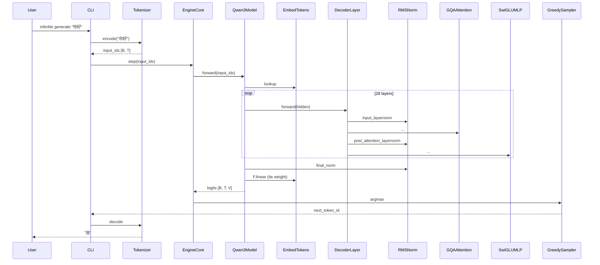

针对刚完成的里程碑 `$ARGUMENTS`（如 M1a），把过程中积累的草稿整理成正式主线文档。

## 1. 验收前置

- 所有任务卡 ✅？
- `~/learning/docs/projects/inferlite/mainline/$ARGUMENTS-*.md` 草稿区有内容？
- 本 M 用到的 knowledge 卡都已沉淀？

任一不满足 → 输出未完成项，停止。

## 2. 读源材料

- `mainline/$ARGUMENTS-*.md`（草稿）
- 本 M 的所有任务卡 `~/learning/inferlite/docs/tasks/$ARGUMENTS-T*.md`
- 本 M 期间的 lessons / decisions
- 本 M 用到的所有 knowledge 卡
- `inferlite/` 代码本身（grep 本 M 引入的所有 `class` / `def`）

## 3. 重写主线文档

按 `mainline/_TEMPLATE.md` 结构，把 1-9 节填充完整（**不再保留草稿区**）：

### 重点：第 3 节代码流

必须画**完整的 sequenceDiagram 或数据流图**，覆盖本 M 提供的能力。
例：M1 完成时画"一次 generate() 的完整路径"：



### 第 4 节模块清单

`grep` 代码统计每个新增类的行数和角色。

### 第 7 节知识点

按代码流出现顺序列 knowledge/ 卡。

## 4. 提交

```bash
git add docs/projects/inferlite/mainline/$ARGUMENTS-*.md
```

注：mainline 在工作区根的 docs/projects/，不在 inferlite/ git 仓库内。所以这步实际是 `cd ~/learning/docs/projects/inferlite/ && git add` —— 但该目录目前不是 git 仓库，跳过 commit，只通知用户文件已落地。

## 5. 输出报告

```
$ARGUMENTS 主线文档已归档

文件: docs/projects/inferlite/mainline/$ARGUMENTS-*.md (约 N 行)
代码流图: 已绘制（M 个 sequence steps）
模块清单: K 个新增类
引用 knowledge 卡: J 张
引用 lessons: L 篇

下一步建议: /archive-milestone $ARGUMENTS  (生成最终 summary)
```

## 6. 不做
- 不要保留草稿区（草稿已被整合）
- 不要遗漏代码流图（这是主线的核心价值）
- 不要修改 inferlite/ 业务代码
