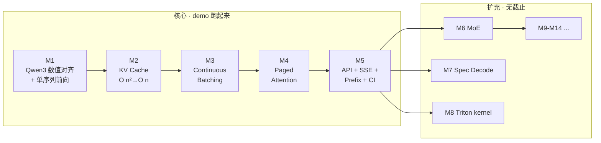

<div align="center">

# inferlite

**从零手写一个可读、可跑、可解释的 LLM 推理引擎**

覆盖 vLLM 核心思想 — KV cache · PagedAttention · Continuous Batching · Prefix Cache —
按里程碑驱动持续扩充（MoE / Spec Decoding / Triton / VLM …）

[](https://luhao-lab.github.io/inferlite/)
[](https://github.com/luhao-lab/inferlite/actions/workflows/tests.yml)
[](LICENSE)
[](https://www.python.org/downloads/)
[](https://github.com/astral-sh/uv)

[**🌐 在线文档站**](https://luhao-lab.github.io/inferlite/)  ·  [路线图](docs/plan/PLAN.md)  ·  [实时进度](docs/plan/PROGRESS.md)  ·  [当前作战 M4](docs/plan/M4.md)

</div>

---

## 项目定位

| 不变量 | 说明 |
| --- | --- |
| **代码默认本人手写** | 作者本人手写 `inferlite/*.py`；Agent 默认仅辅助研究 / 计划 / Review / 测试 / 文章，**除非作者明确要求实现或修改，否则不得改动核心代码** |
| **里程碑闭环** | 每个 M 完成 = ① 代码 push  ② 知乎文章发布  ③ PROGRESS 更新 |
| **学习 > 性能** | 优先可读性；性能优化作为后续里程碑慢慢加 |
| **Spec-driven** | 任务卡 7 字段（前置/边界/验收/风险/完成总结），见 [ADR-001](docs/knowledge/knowledge.md) |

## 30 秒 Quick Start

```bash
git clone git@github.com:luhao-lab/inferlite.git
cd inferlite
make setup            # uv 装环境 + sanity check
make test             # 跑全量测试
make preflight        # 一键拉 Qwen3-0.6B + 端到端跑一句话
```

更多命令见 [`make help`](docs/README.md) 或 `docs/README.md`。

## 路线图



完整 14 个里程碑见 [`docs/plan/PLAN.md`](docs/plan/PLAN.md)。

## 当前进度

- ✅ **M0** 仓库 + 计划 + 知识库脚手架
- ✅ **M1** Qwen3 数值对齐 + 单序列前向（tag: `m1/naive-forward`，2026-06-19）
  - 95 个单测全绿，Qwen3-0.6B e2e 与 transformers 精确对齐
- ✅ **M2** KV Cache（tag: `m2-complete`，2026-06-29）
  - T1~T5 全部完成，新增 28 个单测，M1/M2 端到端 bench 实测加速 7.36×
- ✅ **M3** Continuous Batching（tag: `m3/continuous-batching`，2026-07-19）
  - T1~T7 全部完成，fixed-slot continuous batching + metrics/benchmark，E2E 与 serial generate 等价
- 🟡 **M4** PagedAttention
  - T1 BlockPool 已完成（commit: `7d51e25`）；T2–T7 继续推进
- ⬜ **M5** Prefix Caching
- ⬜ M6+ MoE / Spec Decoding / Triton / VLM …

实时状态见 [`docs/plan/PROGRESS.md`](docs/plan/PROGRESS.md)。

## 文档导航

| 入口 | 内容 |
| --- | --- |
| 🌐 [**在线文档站**](https://luhao-lab.github.io/inferlite/) | 极客风深色主题 · 全文搜索 · mermaid 渲染 |
| 🗺️ [`docs/plan/`](docs/plan/) | 里程碑路线、技术设计、任务拆解与实时进度 |
| 📋 [`docs/tasks/`](docs/tasks/) | 可执行任务卡：接口合同、测试清单、DoD 与完成总结 |
| 📚 [`docs/knowledge/`](docs/knowledge/) | 跨任务知识：原理、架构对比、里程碑复盘与可复用教训 |
| 📊 [`bench/results/`](bench/results/) | 可复现 benchmark 原始结果与分析 |
| ⚙️ [`docs/README.md`](docs/README.md) | 环境、命令和文档索引速查 |
| 🤖 [`CLAUDE.md`](CLAUDE.md) | AI 协作约定（双轨制 · spec-driven） |

## 目录职责

### 仓库顶层

| 目录 / 文件 | 作用 | 不应放什么 |
|---|---|---|
| `inferlite/` | 推理引擎核心 Python 包 | 学习总结、benchmark 结果 |
| `tests/` | 单元测试与端到端语义测试 | 核心业务实现 |
| `docs/` | 项目计划、任务卡和知识沉淀 | 可执行核心代码 |
| `bench/results/` | 固定环境下的 benchmark 数据、参数和结论 | 临时调试输出 |
| `scripts/` | setup、preflight、benchmark 等可重复执行脚本 | 核心模型/引擎逻辑 |
| `.github/` | CI、GitHub Pages 和仓库自动化 | 本地开发配置 |
| `.claude/` | 项目级 AI 工作流命令 | 产品运行时代码 |
| `site/` | MkDocs 生成的静态站点产物 | 手工维护的源文档 |
| `pyproject.toml` / `uv.lock` | 依赖、工具链与可复现环境 | 业务配置 |
| `Makefile` | 常用开发命令统一入口 | 复杂业务逻辑 |
| `mkdocs.yml` | 文档站导航和主题配置 | 文档正文 |

`.venv/`、`.pytest_cache/`、`.ruff_cache/`、`.mypy_cache/` 和 `__pycache__/` 都是本地生成物，不属于项目源代码。

### 核心包 `inferlite/`

| 目录 / 文件 | 作用 |
|---|---|
| `config.py` | 模型结构配置及反序列化 |
| `model/` | Qwen3 网络层、attention、权重加载等模型计算 |
| `cache/` | M2/M3/M4 的 KV Cache 数据结构与内存管理 |
| `scheduler/` | 请求状态、排队、admission 和生命周期调度 |
| `engine/` | 串接 model/cache/scheduler/sampler 的生成主循环与指标 |
| `sampler/` | greedy 等 token 选择策略 |
| `entrypoints/` | 面向用户的高级调用入口；不承载底层 cache 机制 |
| `server/` | API/SSE 服务层（对应后续服务化里程碑） |
| `utils/` | 无明确业务归属的通用小工具；禁止变成杂物目录 |
| `cli.py` | 命令行参数解析和组件装配 |

依赖方向应保持清晰：`entrypoints/server/cli → engine → scheduler + model + cache + sampler`。`cache/` 不依赖请求对象，`model/` 不负责请求调度，避免层间反向耦合。

### 测试目录 `tests/`

| 目录 | 作用 |
|---|---|
| `tests/unit/` | 单个类/函数的接口合同、数值和边界测试 |
| `tests/e2e/` | 串行与 batch、不同 cache 路径等跨模块语义等价测试 |

测试应尽量构造确定性 oracle。涉及 `torch.empty` 等未初始化内存时，应显式注入 NaN/Inf，不能依赖 allocator 偶然返回的内容。

### 文档目录 `docs/`

| 目录 / 文件 | 核心问题 | 更新时机 |
|---|---|---|
| `docs/plan/` | “准备做什么、为什么这样拆？” | 里程碑开始前；设计或范围变化时 |
| `docs/tasks/` | “这一步怎么做、如何验收、最终做成什么？” | 每张任务开始、Review 和完成时 |
| `docs/knowledge/` | “这个技术为何这样工作、有哪些可复用结论？” | 调研时持续补充；里程碑 T7 统一收口 |
| `docs/knowledge/lessons.md` | “踩过什么坑，怎样避免再次发生？” | 出现可跨任务复用的教训时 |
| `docs/README.md` | 文档、环境和命令的详细索引 | 目录或工作流变化时 |
| `docs/_assets/` | 文档使用的图片等静态资源 | 文档引用资源时 |

文档流转遵循：

```text
plan：确定范围和 ADR
  ↓
task：落实单步接口、测试、DoD 和完成总结
  ↓
knowledge：提炼跨任务原理、整体实现与里程碑复盘
  ↓
lessons：抽取可在其他任务复用的踩坑经验
```

同一内容不应机械复制：任务卡保留精确实现记录，knowledge 解释整体原理，plan 只维护当前有效的设计决策。

## 技术栈

- **Python** 3.12 + **PyTorch** 2.4+（当前 lock：2.12.0）
- **主模型**：Qwen3-0.6B（M1–M5 起步） · 通过 ModelScope 拉
- **Tokenizer**：复用 `transformers.AutoTokenizer`
- **数值对齐基准**：当前 `uv.lock` 锁定的 `transformers==5.10.2`
- **Server**：FastAPI + SSE（M5 引入）
- **硬件**：Mac MPS 主开发（M1–M7） · GPU 在 M5 benchmark / M8 Triton 必需
- **工具链**：uv · ruff · pytest · pre-commit · MkDocs Material

## 工作流（spec-driven · 5 个 slash commands）

```text
/plan <scope>      规划（M / T / 调整），含前置调研
/work <task>       开任务卡，含 knowledge gap 检查
/review <task>     review 已完成任务卡
/archive <id>      归档（沉淀 lessons + knowledge + summary）
/preflight         环境健康检查
```

详见 [`docs/knowledge/knowledge.md`](docs/knowledge/knowledge.md) 中的 ADR-001。

## License

MIT — 见 [LICENSE](LICENSE)。

---

<div align="center">
<sub>Built with ❤ + uv + PyTorch · Powered by <a href="https://luhao-lab.github.io/inferlite/">MkDocs Material</a></sub>
</div>
