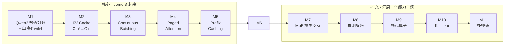

<div align="center">

# inferlite

**从零手写一个可读、可跑、可解释的 LLM 推理引擎**

覆盖 vLLM 核心思想 — KV cache · PagedAttention · Continuous Batching · Prefix Cache —
按里程碑驱动持续扩充（MoE / Spec Decoding / Triton / VLM …）

[](https://luhao-lab.github.io/inferlite/)
[](https://github.com/luhao-lab/inferlite/actions/workflows/tests.yml)
[](LICENSE)
[](https://www.python.org/downloads/)
[](https://github.com/astral-sh/uv)

[**🌐 在线文档站**](https://luhao-lab.github.io/inferlite/)  ·  [路线图](docs/plan/PLAN.md)  ·  [实时进度](docs/plan/PROGRESS.md)  ·  [当前作战 M5](docs/plan/M5.md)

</div>

---

## 项目定位

| 不变量 | 说明 |
| --- | --- |
| **代码默认本人手写** | 作者本人手写 `inferlite/*.py`；Agent 默认仅辅助研究 / 计划 / Review / 测试 / 文章，**除非作者明确要求实现或修改，否则不得改动核心代码** |
| **代码注释是提交门禁** | 每个代码任务提交前，必须为本任务涉及的**所有代码文件**补齐详细注释，包括实现、测试、脚本和配置代码；未完成注释不得提交 |
| **里程碑闭环** | 每个 M 完成 = ① 代码 push  ② 知乎文章发布  ③ PROGRESS 更新 |
| **学习 > 性能** | 优先可读性；性能优化作为后续里程碑慢慢加 |
| **Spec-driven** | 任务卡 7 字段（前置/边界/验收/风险/完成总结），见 [ADR-001](docs/knowledge/knowledge.md) |

## 30 秒 Quick Start

```bash
git clone git@github.com:luhao-lab/inferlite.git
cd inferlite
make setup            # uv 装环境 + sanity check
make test             # 跑全量测试
make preflight        # 一键拉 Qwen3-0.6B + 端到端跑一句话
```

更多命令见 [`make help`](docs/README.md) 或 `docs/README.md`。

## 路线图



完整路线与各里程碑范围见 [`docs/plan/PLAN.md`](docs/plan/PLAN.md)。

## 周计划（从 M4 开始）

> 节奏要求：以自然周（周一至周日）为单位，**每周完成一个 M**。这里的“完成”是达到该里程碑已确认的最小闭环 DoD，而不是把所有生产级优化一次做完。

| 周次 | 日期 | 里程碑 | 本周最小闭环 | 周末交付 |
|---|---|---|---|---|
| W1 | 2026-07-20 ～ 2026-07-26 | **M4 PagedAttention**（起步） | T1 BlockPool：物理 block 元数据池与引用计数 | T1 代码/测试全绿，任务卡归档（`7d51e25`） |
| W2 | 2026-07-27 ～ 2026-08-02 | **M4 PagedAttention**（收口） | T2–T7：BlockTable、PagedKVCache、PyTorch gather attention、batch engine 对齐 | 代码/测试全绿，benchmark，knowledge 收口，tag `m4/paged-attention` |
| W3 | 2026-08-03 ～ 2026-08-09 | **M5 Prefix Caching** | 链式 hash、完整 block 复用、LRU、partial-hit CoW | 重复前缀 E2E、命中率 benchmark、文档与 tag |
| W4 | 2026-08-10 ～ 2026-08-16 | **M6 API + SSE** | `inferlite serve`、请求协议、流式输出、基础 sampling 参数 | curl 可用、服务 E2E、v1.0 demo/Release 收口 |
| W5 | 2026-08-17 ～ 2026-08-23 | **M7 MoE 模型支持** | 先跑通 MoE forward/dispatch，再做本周范围内可验证的优化 | 小模型 E2E、dense 回归、设计总结与 tag |
| W6 | 2026-08-24 ～ 2026-08-30 | **M8 推测解码** | n-gram draft + verify/accept/rollback；EAGLE 只在前置具备时纳入 | token 等价、接受率与加速 benchmark、文档与 tag |
| W7 | 2026-08-31 ～ 2026-09-06 | **M9 核心算子加速** | cache write / paged attention kernel；Mac 保留可验证 fallback | GPU 正确性与性能对比、fallback 回归、文档与 tag |
| W8 | 2026-09-07 ～ 2026-09-13 | **M10 长上下文** | Chunked Prefill + YaRN/NTK RoPE scaling 最小闭环 | 长 prompt E2E、内存/延迟结果、文档与 tag |
| W9 | 2026-09-14 ～ 2026-09-20 | **M11 多模态** | VLM 教学链路：图片编码、`inputs_embeds`、LLM decode | 小 VLM E2E、接口说明、文档与 tag |

M12+ 暂不排固定日期，进入长期能力池；只有 M11（2026-09-20）收口后，才从 LoRA、量化、TP/PP、Audio 等方向中选择一个单独立项。

### 排期调整记录

- **2026-07-28：M4 由一周顺延为两周（W1 + W2），M5～M11 整体右移一周。**
  - 原因一：T1 BlockPool 的接口合同经过三轮 Review 才收敛（`inc_ref` 前置条件、异常类型、free-list 复用顺序、构造参数校验）。
  - 原因二：T1 全量回归时定位并修复了 M3 变长 batch 的 NaN 传播问题，属计划外但必须先修的正确性缺陷（见 [`lessons.md`](docs/knowledge/lessons.md) L5）。
  - W2 直接从「周二～周三 核心实现」进入，不重复执行周一的范围冻结；范围已在 W1 冻结完毕。

这里不采用「压缩 M4 范围赶上原周表」的做法：T2～T5 是 M5 Prefix Caching 的地基，地基上省下的时间会在后面以更高代价还回来。

### 每周执行节奏

| 时间 | 目标 |
|---|---|
| 周一 | 冻结本周 M 的范围、任务卡、接口合同和测试 oracle；确认环境/GPU 等前置 |
| 周二～周三 | 完成核心数据结构与主路径，优先让 L0 单测通过 |
| 周四 | 串联 E2E，补异常路径、数值安全和跨模块回归 |
| 周五 | benchmark、与参考框架对比、修复 Review 问题 |
| 周六 | 补齐所有代码文件详细注释，更新 task/knowledge/lessons |
| 周日 | Ruff/format、定向测试、全量回归、提交 push、PROGRESS、文章和 tag |

### 周完成门禁

每个 M 只有同时满足以下条件才算当周完成：

- [ ] 本周任务卡全部达到 DoD，不把未完成项口头顺延后仍标记完成。
- [ ] 本 M 涉及的所有实现、测试、脚本和配置代码均有足够的教学级注释。
- [ ] Ruff / format、定向测试、E2E 和全量回归全部通过。
- [ ] 至少有一组可复现 benchmark；若本 M 不追求性能，也要记录正确性和开销。
- [ ] 每张任务卡追加完成总结，knowledge/lessons 同步关键结论。
- [ ] README、PROGRESS 更新，代码已 push，并创建对应 annotated tag。

如果周中发现范围超过一周，必须在继续实现前缩小本 M 的最小闭环，剩余能力重新立项；不得用跳过测试、注释、文档或 benchmark 的方式赶进度。

## 当前进度

- ✅ **M0** 仓库 + 计划 + 知识库脚手架
- ✅ **M1** Qwen3 数值对齐 + 单序列前向（tag: `m1/naive-forward`，2026-06-19）
  - 95 个单测全绿，Qwen3-0.6B e2e 与 transformers 精确对齐
- ✅ **M2** KV Cache（tag: `m2-complete`，2026-06-29）
  - T1~T5 全部完成，新增 28 个单测，M1/M2 端到端 bench 实测加速 7.36×
- ✅ **M3** Continuous Batching（tag: `m3/continuous-batching`，2026-07-19）
  - T1~T7 全部完成，fixed-slot continuous batching + metrics/benchmark，E2E 与 serial generate 等价
- ✅ **M4** PagedAttention（tag: `m4/paged-attention`，2026-08-11）
  - T1~T8 全部完成，PagedKVCache + PagedAttention + ForwardContext/CacheAdapter 统一架构，270 tests 全绿
- ✅ **M5** Prefix Caching（tag: `m5/prefix-caching`，2026-08-19）
  - T1~T5 全部完成，chain hash + LRU + CoW + cache-aware allocate，314 tests 全绿
- ⬜ **M6** API + SSE
- ⬜ **M7–M11** MoE / 推测解码 / 核心算子 / 长上下文 / 多模态

实时状态见 [`docs/plan/PROGRESS.md`](docs/plan/PROGRESS.md)。

## 文档导航

| 入口 | 内容 |
| --- | --- |
| 🌐 [**在线文档站**](https://luhao-lab.github.io/inferlite/) | 极客风深色主题 · 全文搜索 · mermaid 渲染 |
| 📖 [**从零手写 LLM 推理引擎（二）：KV Cache 的五次进化**](docs/knowledge/kv-cache-evolution.md) | M2→M5 统一技术演进：从无缓存到 Prefix Caching，一篇讲透 KV Cache 的五次结构跃迁 |
| 🗺️ [`docs/plan/`](docs/plan/) | 里程碑路线、技术设计、任务拆解与实时进度 |
| 📋 [`docs/tasks/`](docs/tasks/) | 可执行任务卡：接口合同、测试清单、DoD 与完成总结 |
| 📚 [`docs/knowledge/`](docs/knowledge/) | 跨任务知识：原理、架构对比、里程碑复盘与可复用教训 |
| 📊 [`bench/results/`](bench/results/) | 可复现 benchmark 原始结果与分析 |
| ⚙️ [`docs/README.md`](docs/README.md) | 环境、命令和文档索引速查 |
| 🤖 [`CLAUDE.md`](CLAUDE.md) | AI 协作约定（双轨制 · spec-driven） |

## 目录职责

### 仓库顶层

| 目录 / 文件 | 作用 | 不应放什么 |
|---|---|---|
| `inferlite/` | 推理引擎核心 Python 包 | 学习总结、benchmark 结果 |
| `tests/` | 单元测试与端到端语义测试 | 核心业务实现 |
| `docs/` | 项目计划、任务卡和知识沉淀 | 可执行核心代码 |
| `bench/results/` | 固定环境下的 benchmark 数据、参数和结论 | 临时调试输出 |
| `scripts/` | setup、preflight、benchmark 等可重复执行脚本 | 核心模型/引擎逻辑 |
| `.github/` | CI、GitHub Pages 和仓库自动化 | 本地开发配置 |
| `.claude/` | 项目级 AI 工作流命令 | 产品运行时代码 |
| `site/` | MkDocs 生成的静态站点产物 | 手工维护的源文档 |
| `pyproject.toml` / `uv.lock` | 依赖、工具链与可复现环境 | 业务配置 |
| `Makefile` | 常用开发命令统一入口 | 复杂业务逻辑 |
| `mkdocs.yml` | 文档站导航和主题配置 | 文档正文 |

`.venv/`、`.pytest_cache/`、`.ruff_cache/`、`.mypy_cache/` 和 `__pycache__/` 都是本地生成物，不属于项目源代码。

### 核心包 `inferlite/`

| 目录 / 文件 | 作用 |
|---|---|
| `config.py` | 模型结构配置及反序列化 |
| `model/` | Qwen3 网络层、attention、权重加载等模型计算 |
| `cache/` | M2/M3/M4 的 KV Cache 数据结构与内存管理 |
| `scheduler/` | 请求状态、排队、admission 和生命周期调度 |
| `engine/` | 串接 model/cache/scheduler/sampler 的生成主循环与指标 |
| `sampler/` | greedy 等 token 选择策略 |
| `entrypoints/` | 面向用户的高级调用入口；不承载底层 cache 机制 |
| `server/` | API/SSE 服务层（对应后续服务化里程碑） |
| `utils/` | 无明确业务归属的通用小工具；禁止变成杂物目录 |
| `cli.py` | 命令行参数解析和组件装配 |

依赖方向应保持清晰：`entrypoints/server/cli → engine → scheduler + model + cache + sampler`。`cache/` 不依赖请求对象，`model/` 不负责请求调度，避免层间反向耦合。

### 测试目录 `tests/`

| 目录 | 作用 |
|---|---|
| `tests/unit/` | 单个类/函数的接口合同、数值和边界测试 |
| `tests/e2e/` | 串行与 batch、不同 cache 路径等跨模块语义等价测试 |

测试应尽量构造确定性 oracle。涉及 `torch.empty` 等未初始化内存时，应显式注入 NaN/Inf，不能依赖 allocator 偶然返回的内容。

### 文档目录 `docs/`

| 目录 / 文件 | 核心问题 | 更新时机 |
|---|---|---|
| `docs/plan/` | “准备做什么、为什么这样拆？” | 里程碑开始前；设计或范围变化时 |
| `docs/tasks/` | “这一步怎么做、如何验收、最终做成什么？” | 每张任务开始、Review 和完成时 |
| `docs/knowledge/` | “这个技术为何这样工作、有哪些可复用结论？” | 调研时持续补充；里程碑 T7 统一收口 |
| `docs/knowledge/lessons.md` | “踩过什么坑，怎样避免再次发生？” | 出现可跨任务复用的教训时 |
| `docs/README.md` | 文档、环境和命令的详细索引 | 目录或工作流变化时 |
| `docs/_assets/` | 文档使用的图片等静态资源 | 文档引用资源时 |

文档流转遵循：

```text
plan：确定范围和 ADR
  ↓
task：落实单步接口、测试、DoD 和完成总结
  ↓
knowledge：提炼跨任务原理、整体实现与里程碑复盘
  ↓
lessons：抽取可在其他任务复用的踩坑经验
```

同一内容不应机械复制：任务卡保留精确实现记录，knowledge 解释整体原理，plan 只维护当前有效的设计决策。

## 技术栈

- **Python** 3.12 + **PyTorch** 2.4+（当前 lock：2.12.0）
- **主模型**：Qwen3-0.6B（M1–M5 起步） · 通过 ModelScope 拉
- **Tokenizer**：复用 `transformers.AutoTokenizer`
- **数值对齐基准**：当前 `uv.lock` 锁定的 `transformers==5.10.2`
- **Server**：FastAPI + SSE（M5 引入）
- **硬件**：Mac MPS 主开发（M1–M7） · GPU 在 M5 benchmark / M8 Triton 必需
- **工具链**：uv · ruff · pytest · pre-commit · MkDocs Material

## 工作流（spec-driven · 5 个 slash commands）

```text
/plan <scope>      规划（M / T / 调整），含前置调研
/work <task>       开任务卡，含 knowledge gap 检查
/review <task>     review 已完成任务卡
/archive <id>      归档（沉淀 lessons + knowledge + summary）
/preflight         环境健康检查
```

详见 [`docs/knowledge/knowledge.md`](docs/knowledge/knowledge.md) 中的 ADR-001。

### 代码任务提交前检查

每个涉及代码变更的任务，在执行 `git commit` 前必须逐个检查本任务的**全部新增和修改代码文件**：

- `inferlite/**/*.py`：核心实现、入口、模型、cache、scheduler、engine 等。
- `tests/**/*.py`：单元测试、E2E 测试、fixture 和测试辅助代码。
- `scripts/**/*.py` / `scripts/**/*.sh`：环境、benchmark、preflight 和维护脚本。
- 其他可执行配置代码：CI、构建脚本及本任务修改的自动化配置。

详细注释至少应覆盖：

1. **文件职责与边界**：解决什么问题，不负责什么。
2. **关键数据结构与 shape**：维度语义、状态字段、生命周期和不变量。
3. **非直观算法与设计原因**：不仅写“做什么”，还要解释“为什么这样做”。
4. **边界与异常路径**：非法输入、容量耗尽、数值安全和资源释放。
5. **测试意图**：每个测试锁定什么合同、为何构造该场景、ground truth 来自哪里。
6. **后续里程碑边界**：明确哪些能力刻意留到后续，避免提前混入。

注释以帮助学习和维护为目标，不要求机械地逐行复述语法。简单赋值和一眼可见的控制流无需重复解释；复杂状态转换、tensor shape、mask、缓存生命周期及容易误用的 API 必须说明。

提交门禁：

```text
所有代码文件注释检查完成
  -> Ruff / format 通过
  -> 定向测试通过
  -> 全量回归通过
  -> 更新任务卡完成总结
  -> git commit
```

若任务卡 DoD 未单列“所有代码文件详细注释”，仍默认受本规则约束。

## License

MIT — 见 [LICENSE](LICENSE)。

---

<div align="center">
<sub>Built with ❤ + uv + PyTorch · Powered by <a href="https://luhao-lab.github.io/inferlite/">MkDocs Material</a></sub>
</div>
