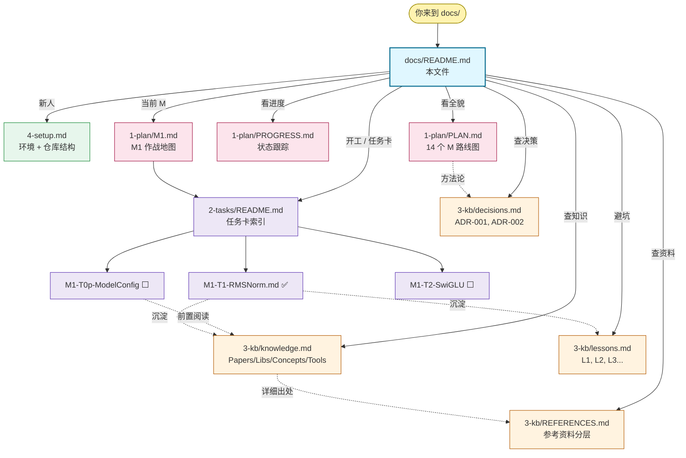

# inferlite 文档地图

> 这是文档总入口。下面这张图说明所有 .md 文件的角色与跳转关系；
> 点击节点直接进入对应文档。

## 1. 文档地图



> GitHub / MkDocs Material 都原生渲染上图。

---

## 2. 三类文档（按"何时读"分类）

| 子目录 | 角色 | 何时读 | 文件 |
| --- | --- | --- | --- |
| `1-plan/` | **规划层**：未来要做什么 | 开新 M / 调路线时 | PLAN.md, PROGRESS.md, M\<n\>.md |
| `2-tasks/` | **执行层**：当前在做什么 | 开任务卡 / 写代码时 | _TEMPLATE.md, M\<n\>-T\*.md |
| `3-kb/` | **知识层**：积累的资产 | 开工前查 / 卡完成时沉淀 | knowledge.md, lessons.md, decisions.md, REFERENCES.md |
| `4-setup.md` | 顶层独立：环境与仓库结构 | 第一天 / 加新工具时 | — |

`1 → 2 → 3` 也是任务推进流：先规划（plan）→ 再执行（tasks）→ 最后沉淀（kb）。

---

## 3. 三条典型阅读路径

### 3.1 新人 onboarding（30 min）
1. [4-setup.md](./4-setup.md) — 环境一键装 + 仓库结构图
2. [1-plan/PLAN.md](./1-plan/PLAN.md) §0-2 — 项目定位 + 14 个 M 总览
3. [1-plan/M1.md](./1-plan/M1.md) §1-3 — 当前 M 作战范围
4. [3-kb/REFERENCES.md](./3-kb/REFERENCES.md) — 三梯队参考项目

### 3.2 开始一张任务卡（5 min）
1. [1-plan/PROGRESS.md](./1-plan/PROGRESS.md) — 找到下一张 ⬜ 任务
2. 在 [2-tasks/](./2-tasks/README.md) 中读对应任务卡 7 字段
3. [3-kb/knowledge.md](./3-kb/knowledge.md) — 按任务卡"前置"段查相关章节
4. [3-kb/lessons.md](./3-kb/lessons.md) — 避坑（按任务卡引用）

### 3.3 复盘（任务卡 / M 完成时）
1. 在任务卡末尾追加"完成总结"段
2. 新坑 → [3-kb/lessons.md](./3-kb/lessons.md) 追加 L\<N\>
3. 新引入的 API/概念 → [3-kb/knowledge.md](./3-kb/knowledge.md) 对应 H2 加 H3
4. 重大决策 → [3-kb/decisions.md](./3-kb/decisions.md) 加 ADR
5. `/archive task <id>` 自动跑上述流程

---

## 4. 本地浏览（MkDocs Material）

```bash
cd inferlite
make docs-serve            # http://localhost:8000
make docs-build            # 输出到 site/
```

效果：左侧 sidebar 自动按 1-plan / 2-tasks / 3-kb 分组、顶部全文搜索、暗色模式、mermaid 自动渲染。

详见 [4-setup.md](./4-setup.md) §6 文档站。

---

## 5. AI 协作

- AI 协作约定见仓库根 `CLAUDE.md`
- 5 个 slash 命令对应 5 个文档动作：
  - `/plan <scope>` → 1-plan/ 新增/调整
  - `/work <task>` → 2-tasks/ 中开卡
  - `/review <task>` → 检查
  - `/archive task|milestone` → 沉淀到 3-kb/
  - `/preflight` → 环境体检（不动文档）
